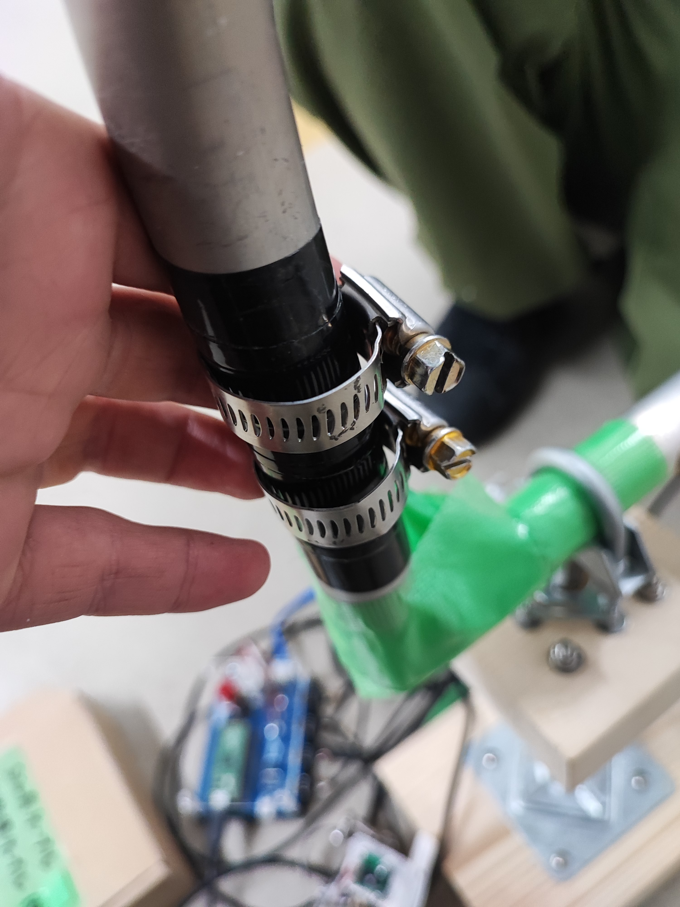
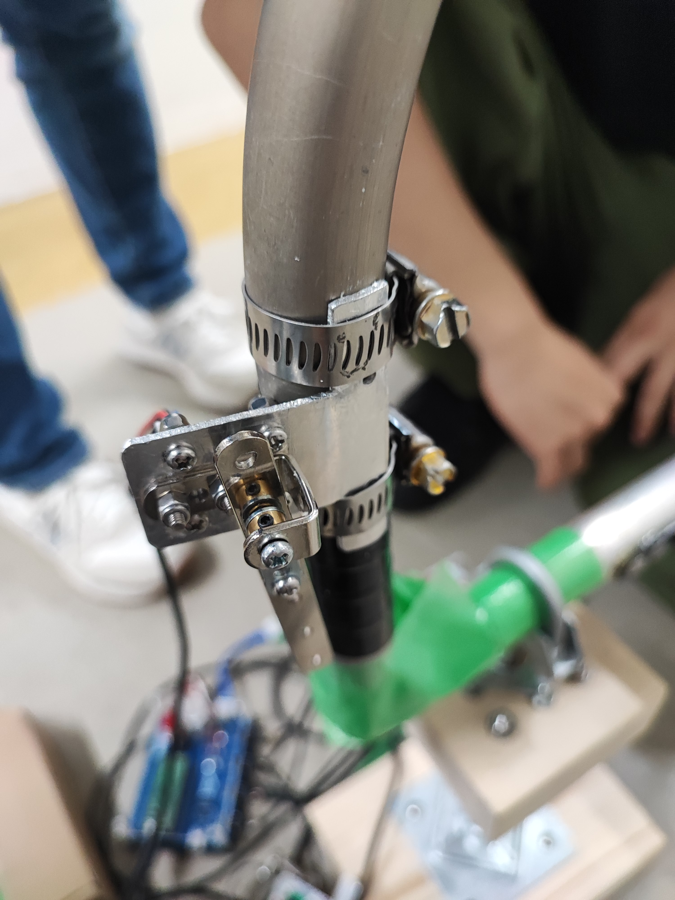
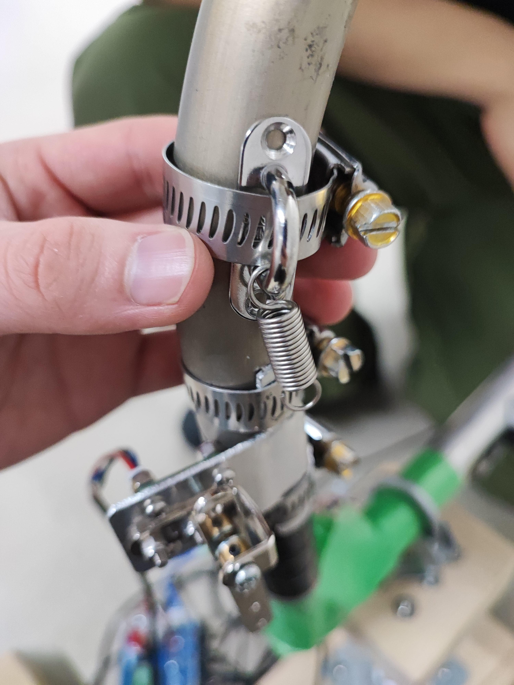
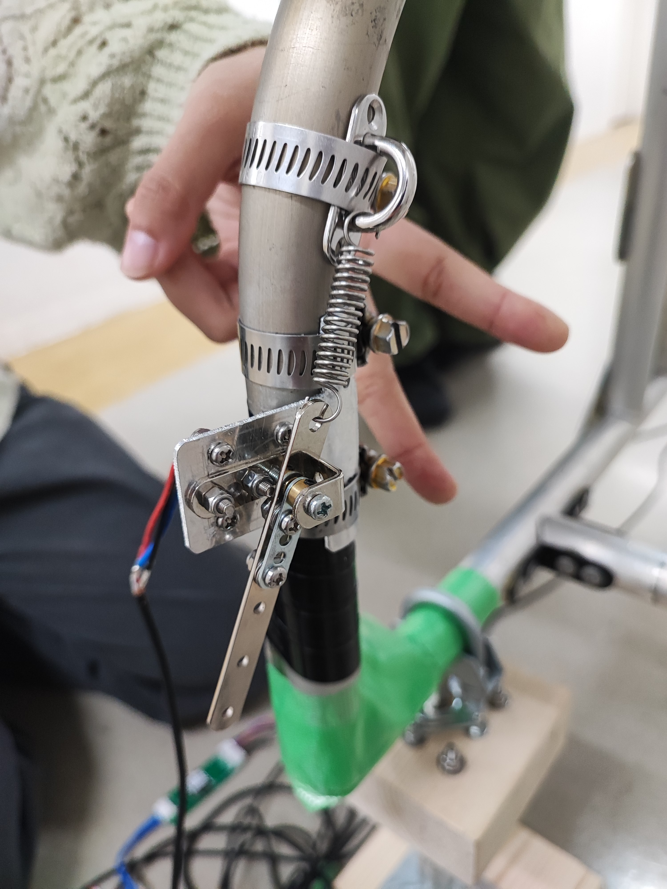

# 【鳥科25代】操縦桿の取付方法
|1|まず，ホースバンドを2つ取り付けます．バンドの溝とねじが噛み合い始めれば十分です．|
|---|:---|
|||

|2|次に，ホースバンドの隙間に操縦桿本体を差し込み，ホースバンドを締め付けて適当な位置で固定します．|
|---|:---|
|||

|3|次に，ばねを取り付けます．フックにホースバンドを通してからのほうが楽に取り付けられます．パイロットに確認しながら，操縦桿の反発力を調整します．|
|---|:---|
|||

|4|完了です．3つのホースバンド及び操縦桿本体のすべてのねじにゆるみがないことを確認してください．|
|---|:---|
|||
