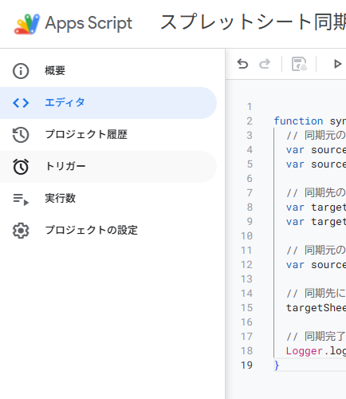
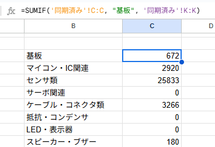

# GASを使ってスプレッドシートを同期する

スプレッドシートの特定のシートを別のスプレッドシートに同期させる．

## 1. スプレッドシートを準備する

|同期先のスプレッドシートを準備する．シート名も変更しておく．|
|--|
||

## 2. Apps Scriptのプロジェクトを作成する
|「拡張機能」➔「Apps Script」をクリック|
|--|
||

|作成されたプロジェクトの名前を変更|
|--|
||


内容を一度全て削除し，以下のコードに置き換える．
```javascript
function syncSpreadsheets() {
  // 同期元のスプレッドシートを開く
  var sourceSpreadsheet = SpreadsheetApp.openByUrl('https://docs.google.com/spreadsheets/d/&%$#&%$#&%$#&%$#&%$#&%$#&%$#&%$#&%$#&%$#/edit'); // 作成者自身で変更してください
  var sourceSheet = sourceSpreadsheet.getSheetByName('同期元シート'); // 作成者自身で変更してください

  // 同期先のスプレッドシートを開く
  var targetSpreadsheet = SpreadsheetApp.openByUrl('https://docs.google.com/spreadsheets/d/&%$#&%$#&%$#&%$#&%$#&%$#&%$#&%$#&%$#&%$#/edit'); // 作成者自身で変更してください
  var targetSheet = targetSpreadsheet.getSheetByName('同期先シート');

  // 同期元のデータを取得
  var sourceData = sourceSheet.getDataRange().getValues();

  // 同期先にデータをコピー
  targetSheet.getRange(1, 1, sourceData.length, sourceData[0].length).setValues(sourceData);

  // 同期完了のログを記録
  Logger.log('データの同期が完了しました。');
}
```

|「実行」をクリック|
|--|
||


|「権限を確認」をクリック|
|--|
||

アカウントを選択し，ログイン

|「権限を確認」をクリック|
|--|
||

|「詳細を表示」➔「無題のプロジェクト（安全ではないページ）に移動」をクリック|
|--|
||

|「続行」をクリック|
|--|
||

|実行ログと同期先のスプレッドシートを確認|
|--|
||

|トリガーを設定|
|--|
||

|「時間ベース」のトリガー（筆者は15分毎に設定），「スプレッドシート」のトリガー（筆者は起動時に設定）の設定を推奨|
|--|
||

## おまけ
|経費精算のカテゴリ分けなどを行う場合，`SUMIF`関数が便利である．|
|--|
||

```
=SUMIF('同期済み'!C:C, "基板", '同期済み'!K:K)
```

上記の関数の場合，`!C:C`（つまり`列C`）に`基板`があるときだけ，`!K:K`（つまり`列K`）の同じ行にある数値を合計してくれる．

先程のスクリプトと組み合わせることで，編集できない場所にあるスプレッドシートを同期し，カテゴリ毎に合計することができる．
